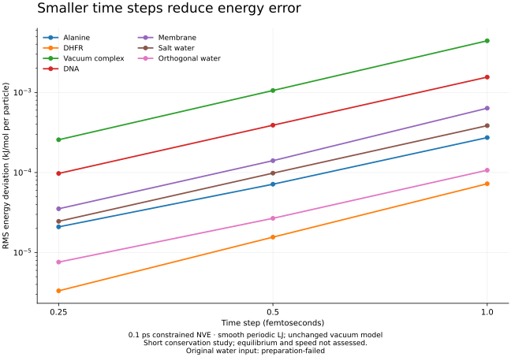

# Independent MD panel, coordinate precision and constrained dynamics

This milestone implements the frontier roadmap's independent benchmark panel
and repairs force, position-precision and constrained-integration defects it
exposed. It does not complete the entire frontier
roadmap or establish scientific or performance leadership.

## Implemented behavior

`numivivo md-benchmark` compares the owning Metal runtime with separately
generated reference energies and forces. Reports bind the complete request,
numerical contract and evaluated geometry. Failed dynamics retain completed
static comparisons. The campaign retains failed preparation, native commands,
stdout/stderr, exit codes, reports and independent verification failures.

An isolated torsion comparison found that the previous periodic-torsion force
had the correct magnitude and opposite sign. OpenMM Reference and independent
central energy differences agree on the correction. Profile v4 repairs all
four atomic force contributions without changing the energy. Historical v3
trajectories are not relabeled; continuation under a different contract rejects.

Realistic FP32 position projection still failed the unchanged relative distance
tolerance of 1e-6. An independent rounding diagnostic projects reference water
and DHFR, then rounds their coordinates to FP32. This increases maximum relative
constraint error from about 3.1e-8 to 2.53e-6 for water and from 3.4e-8 to 6.99e-6
for DHFR. Respectively 247 and 6,641 constraints exceed 1e-6 after rounding.
This identifies precision loss; it is not an impossibility proof for every
representable constrained geometry.

Profile v5 adds opt-in compensated positions to the same transactional runtime.
Drift and constraint operations retain high and low FP32 words. Checkpoints
preserve both exact words, even when their Double sum loses the smallest part.
Forces and velocities remain FP32. Read-only probes preserve accepted state;
failed operations preserve both words and the clock. NPT, virtual/Drude sites,
external candidate force providers, minimization and FP32 trajectory archives
are explicitly outside this initial compensated mode.

The first interacting NVE study then exposed artificial energy loss: geometric
projection along changing trial normals damped tangential motion. Profile v6
uses start-of-drift RATTLE normals, including both Langevin half drifts. A free
rigid rotor now retains energy and angular momentum within its declared limits.
The original failed study remains in `nve-6`; its policy was not loosened.

PME accumulation is not generally bitwise deterministic. Repeating the same
frozen v5 binary/request produced a maximum static force difference of
0.0008544921875 kJ/mol/nm, identical prepared checkpoints and different final
checkpoints, while both force comparisons passed. Exact checkpoint-word storage
does not imply bitwise replay for all PME dynamics. A related reporting defect
was fixed by retaining one authoritative energy observation per sampled boundary;
repeated reductions no longer create inconsistent duplicate endpoint records.

## Independent reference and fixed limits

Reference dependencies are OpenMM 8.6.0, NumPy 2.5.3 and SciPy 1.18.1 in an
isolated Python 3.13 environment. OpenMM's CPU Reference platform supplies
independent FP64 observations; it is not a native production force provider.
Inputs are pinned to openmmtools revision
`f6ef22a8b9f66e582df2ffa62f3bb6516de43536` or the installed OpenMM package data.
Serialized reference systems, input files and their hashes are retained.

All three geometries per prepared system use identical explicit FP32 coordinates
and cells in both engines. Models, geometries and limits were unchanged across
the torsion and precision repairs. Native precision and explicit initial
constraint projection are recorded execution choices. Fixed limits are 0.002
kJ/mol per particle in energy, 0.001 normalized force RMS, 0.01 normalized maximum
force component, and unchanged evaluated geometry. Constraint tolerance remains
1e-6. The Python verifier independently checks saved positions and velocities.

| System | Particles | Final v6 static comparisons | Final v6 dynamics |
| --- | ---: | --- | --- |
| Original AMBER water | 648 | Reference preparation failed | Not run |
| Solvated alanine dipeptide | 2,269 | 3/3 passed | 100/100 steps |
| Solvated DHFR | 23,558 | 3/3 passed | 100/100 steps |
| Supplied vacuum T4 lysozyme/ligand complex | 2,621 | 3/3 passed | 100/100 steps |
| Solvated DNA dodecamer | 13,646 | 3/3 passed | 100/100 steps |
| POPC membrane | 32,512 | 3/3 passed | 100/100 steps |
| NaCl in water | 2,681 | 3/3 passed | 100/100 steps |
| Separately named orthogonal water | 2,685 | 3/3 passed | 100/100 steps |

The original water cell cannot support the fixed 0.8 nm reference cutoff. Its
failure remains in every derived panel; the overall campaign is therefore
not all-pass. The separately identified orthogonal water does not replace it.
Prepared-system success does not qualify automatic chemical perception or
parameters. The complex retains its vacuum model.

## Short interacting NVE refinement

Sharp LJ cutoffs can introduce energy jumps when pairs cross the cutoff. The
original panel retains that Hamiltonian and its failed or inconsistent initial
refinement records (`nve-7`). A separately named reference panel switches periodic
LJ interactions from 0.7 to 0.8 nm in both OpenMM and native configurations.
All independent energies and forces were recalculated. The vacuum complex
retains its original model. This is an explicitly different model, not a relabeling
of the original sharp-cutoff qualification.

The same policy, committed before the first NVE measurement, requires maximum
energy deviation <= 0.01 kJ/mol per particle and RMS improvement >= 2 when the
time step halves, with an explicit 1e-5 kJ/mol per particle refinement floor.
Each variant runs 0.1 ps from identical prepared position and velocity words,
with observations every 0.005 ps. Time steps are 1, 0.5 and 0.25 fs.

| Smooth-model case | Maximum energy deviation at 1 fs (kJ/mol per particle) | RMS improvement, 1→0.5 fs / 0.5→0.25 fs |
| --- | ---: | ---: |
| Alanine | 0.000511 | 3.82 / 3.41 |
| DHFR | 0.000147 | 4.64 / 4.68 |
| Unchanged vacuum complex | 0.008052 | 4.18 / 4.12 |
| DNA | 0.002508 | 3.99 / 4.00 |
| Membrane | 0.001009 | 4.52 / 3.99 |
| Salt water | 0.000633 | 3.92 / 4.00 |
| Orthogonal water | 0.000323 | 3.99 / 3.52 |

All seven prepared cases passed conservation and refinement in `nve-smooth-8`;
all 21 trajectories committed their 100, 200 or 400 requested steps. Original
water preparation remains failed, so the complete panel's all-pass flag is false.
These are short numerical conservation checks, not equilibrium, transport,
biological or speed qualification.

## Source and native evidence

Runs use the Apple M4 Pro Mac mini with 24 GiB unified memory, Xcode 26.6 and
Swift 6.3.3. Exact executable and shader hashes accompany each frozen binary.

- Baseline `ebf7ed655f6dea852cdd3cc6eaac8b4edbbf7b7d`: 27 reported native tests
  in five suites passed before edits.
- Torsion repair `84dc8fa8c09c561a757a147ffba4e44144ddd2c9`: 32 reported tests
  in seven focused suites passed. Full regression reported 326 tests in 69
  suites passed; the opt-in long archive and full reaction route were skipped.
- Initial compensated source `e315adbf872f49b78ac88fefbfd51bc61ab228ba`: 39
  reported tests in eight focused suites passed; the opt-in long archive was
  skipped. All seven prepared cases passed independent static and 100-step checks.
- Hardened source `3582a00f4a72c6d6954aab7531feefee3296e074`: complete release
  and test-target build passed; 40 reported tests in eight focused suites passed,
  with the opt-in long archive skipped. Its original sharp-cutoff NVE study failed.
- RATTLE source `2fb99ceedb013307413ab294d95a1f1e93b327f9`: 41 reported tests
  in eight focused suites passed, including both rotor precision modes.
- Final executable source `c7ded9f9784d238a329e2ca0ae34b01676165ee2`: release
  and test-target build passed in 229.93 s; 41 reported tests in eight focused
  suites passed (opt-in long archive skipped); all seven original prepared cases
  passed 21 static comparisons and 100 steps each; all seven smooth-model cases
  passed the unchanged three-timestep NVE policy; 12 benchmark CLI checks passed.
  Full native regression reported 332 tests in 70 suites passed in 2954.994 s,
  including the complete reaction-route test in 2181.647 s. The opt-in test
  with more than 100,000 archive chunks was skipped; no new large-archive
  qualification is claimed.

The public CLI also passed 87 sampling/export/connected-workflow checks using
the fresh v6 native prefix and 61 general planner/cache/export/failure checks.
These checks retain copies for intentional corruption and verify that the
original native prefix remains unchanged. They do not add ensemble evidence.

Five source archives were compared with their complete Git blob sets; the final
archive contains 748 files. All 144 files across six frozen executable/shader
sets match their recorded hashes. The actual loaded test image was separately
matched by SHA256 and its sampled Mach-O UUID; SwiftPM's launcher is a different
executable. Independent re-verification recomputed the original force panel and
all three smooth NVE variants from the saved requests, XML and reports.

The fresh native reaction campaign's 72 content objects and preparation,
reaction and encounter receipt/output/payload bindings all verify. Its reaction
payload exactly matches the earlier published finite hydrogen example; changed
rate, temperature and component identities are rejected. This is a fresh
software regression of the same declared example, not broader chemical accuracy.

Retained failed attempts include the initial benchmark test declaration build,
reference API/dependency preparation attempts, an older-Python hash API mismatch,
and a release test build missing `-Xswiftc -enable-testing`. The first smooth
reference attempt also correctly refused to overwrite copied request documents;
the generator now copies source inputs before creating new requests. These were repaired;
their logs were not replaced with successful runs.

Remote evidence root: `/Users/n/numivivo-frontier-evidence-20260908`.
Local evidence copy: `/Users/home/numivivo-frontier-evidence-20260908`.
The local copy omits the Python environment, executable copies and source
bundles/archives; their hashes remain in manifests and originals remain remote.
Reproduction tools and limits are in [Tools/Benchmarks](../../Tools/Benchmarks/README.md).
Compact measured observations and artifact hashes are
[published as JSON](frontier-md-observations.json).
The sealed raw manifest covers 4,600 regular files and five symlinks; every
entry was verified again in the local mirror. Its SHA256 is
`0a86b4311d525b1f68a17eff168896c1c67ee5b98a31b80bcd8b61c4bfe195ab`.
The final publication adds documentation, the plot/helper and the measured
smooth-reference generator fix; the tested native Sources and Tests remain
those of `c7ded9f9784d238a329e2ca0ae34b01676165ee2`.

## Remaining qualification

The subsequent gates are interacting ensemble distributions, longer trajectories,
triclinic cells across every dependent owner, matched-accuracy performance,
efficient sampling/free energies, broader native chemistry and learned-force
qualification, complete realistic workflows, and release qualification. Short
trajectory completion, static agreement and source coverage are separate evidence.

Primary references: [OpenMM precision architecture](https://docs.openmm.org/7.6.0/developerguide/06_opencl_platform.html),
[pinned reference inputs](https://github.com/choderalab/openmmtools/tree/f6ef22a8b9f66e582df2ffa62f3bb6516de43536/openmmtools/data),
[RATTLE](https://doi.org/10.1016/0021-9991(83)90014-1),
[smooth LJ definition](https://docs.openmm.org/latest/userguide/theory/02_standard_forces.html),
[physical validation](https://doi.org/10.1371/journal.pone.0202764).
