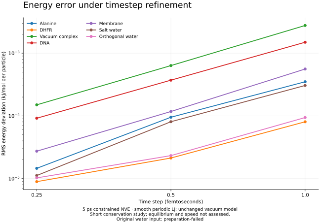
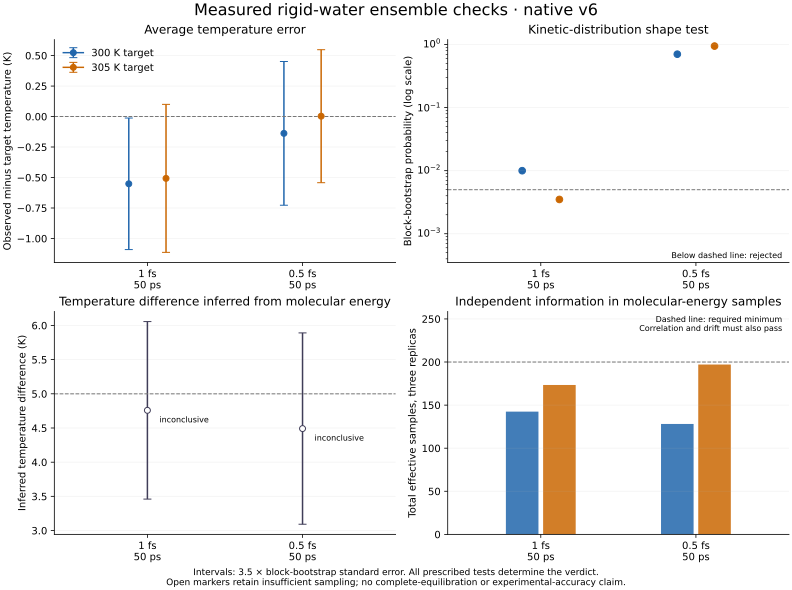

# Longer conservation and interacting ensemble qualification

This milestone extends the [v6 reference panel](2026-09-08_FRONTIER_MD_REFERENCE_PANEL.md)
with a 50-times-longer conservation campaign and an independent interacting-NVT
qualification harness. It uses the same owning Metal runtime and smooth-LJ input
models. Python performs reference checks and statistics; it supplies no production
forces.

## Execution controls and retained failures

The original 128-iteration campaign passed the short gate. A separately named
32-iteration variant, using the runtime default, failed preparation or thermalization
on alanine, DNA, membrane, salt water and orthogonal water with candidate status 8.
DHFR and the vacuum complex completed their short runs. All 21 static comparisons
passed; static force agreement did not rescue the five failed dynamics cases.

The subsequent 64-iteration variant passed all seven prepared systems' static
comparisons, 100-step execution, independent checkpoint constraints and original
0.1 ps three-timestep conservation/refinement gate. The constraint tolerance remains
1e-6. Increasing available solver iterations changes work, not the accepted residual.
The 32-iteration failures remain failed and were not retried under that name.

The original water source still fails independent preparation because its cell
cannot support the declared cutoff. Orthogonal water is a separate fixture. The
retained full-panel result therefore stays nonzero even when prepared cases pass.

## Longer conservation

The prospective policy extends 0.1 to 5 ps at 1, 0.5 and 0.25 fs on all seven
prepared systems. It retains the maximum energy deviation of 0.01 kJ/mol per
particle, minimum RMS refinement ratio 2 and numerical floor 1e-5 kJ/mol per
particle. All variants must share the exact prepared position and velocity words.

All seven prepared systems passed all three time steps: 21 completed trajectories.
All variants retained identical prepared position/velocity words. The largest
energy deviation stayed below the unchanged 0.01 limit, and every RMS refinement
ratio exceeded the required factor 2.

| System | Largest energy deviation, kJ/mol per particle | RMS reduction, 1 to 0.5 fs | RMS reduction, 0.5 to 0.25 fs |
|---|---:|---:|---:|
| Alanine | 0.000680452 | 3.680 | 6.537 |
| DHFR | 0.000198314 | 3.785 | 2.383 |
| Vacuum complex | 0.008051145 | 4.364 | 4.231 |
| DNA | 0.002505599 | 4.028 | 4.046 |
| Membrane | 0.001008762 | 4.761 | 4.296 |
| Salt water | 0.000633983 | 3.786 | 7.217 |
| Orthogonal water | 0.000319156 | 4.050 | 2.266 |

The [compact observations](frontier-long-nve-observations.json) bind the raw
qualification, source identities, report hashes and independent endpoint audits.
Five ps remains far shorter than a production molecular research trajectory.

## Interacting NVT

The [ensemble policy](../../Tools/Benchmarks/ensemble_policy.json) fixes orthogonal
rigid water, 300/305 K, three seeds per temperature, 1/0.5 fs, friction 10/ps and
50 ps per run. It excludes the first 10 ps and retains 800 production observations
per replica. The higher-temperature seeds add 1,000,000 to the base seeds, providing
separate temperature streams while matching initial states across time steps.
These seed and 64-iteration execution controls were finalized before NVT data.
Earlier 32-iteration policy snapshots remain visible and were not measured as NVT.

Independent analysis counts six kinetic degrees of freedom for each nondegenerate
rigid triangle. It refuses other constraint graphs. It checks kinetic mean, width
and prescribed gamma-distribution shape, plus the expected two-temperature
potential-energy density-ratio slope. Fixed one-ps block bootstraps and quality
diagnostics retain correlation, drift, replica disagreement and insufficient
precision as inconclusive. Failed observations are retained even when precision
is insufficient to classify the overall result.

All 12 native trajectories completed, and all six temperature/seed pairs retained
identical prepared position and velocity words across the two time steps. The
original statistical matrix is **failed**: the 1 fs kinetic checks fail, while
the 0.5 fs kinetic checks pass and both configurational checks are inconclusive.

| Time step | Target, K | Mean temperature, K | Mean standard error, K | Gamma CDF bootstrap probability | Kinetic verdict |
|---|---:|---:|---:|---:|---|
| 1 fs | 300 | 299.44855 | 0.15410 | 0.009995 | Failed: mean |
| 1 fs | 305 | 304.49287 | 0.17331 | 0.003498 | Failed: shape |
| 0.5 fs | 300 | 299.86200 | 0.16833 | 0.703648 | Passed |
| 0.5 fs | 305 | 305.00278 | 0.15573 | 0.946027 | Passed |

The 300 K, 1 fs mean is 3.579 standard errors from its target, exceeding the fixed
3.5 limit. The 305 K, 1 fs gamma CDF probability is below the fixed 0.005 limit.
These observations remain failed. The finer-step result is consistent with
reduced finite-step kinetic error; this small matrix does not establish a general
thermostat bias law or qualify every time step.

Potential-energy information remains insufficient at both steps. Effective sample
totals are 142/173 at 1 fs and 128/197 at 0.5 fs, versus the required 200 per
temperature. One-ps block correlations range from 0.363 to 0.452, above 0.3.
Some individual replicas also miss the 40-effective-sample minimum. The fitted
temperature differences are 4.758 and 4.491 K for a requested 5 K; the unresolved
sampling diagnostics prevent certification. All prescribed bootstrap fits completed.

The [complete compact observations](frontier-interacting-ensemble-observations.json)
retain policies, case verdicts, diagnostics, source identities and raw artifact
hashes. Endpoint agreement and native completion do not override these statistics.

## Fixed longer follow-up

The separately declared adaptive policy continues all six 0.5 fs replicas to
210 ps, retains the original 10 ps exclusion, and uses five-ps blocks. This gives
40 complete blocks and 4,000 production observations per replica. The original
coarse subset motivated this duration/block choice before any continuation data.
All statistical acceptance limits remain unchanged, and the original 50 ps
campaign is retained with its failed and inconclusive verdicts.

The continuation harness is published at
`a1b363b63fedec196bc4e4e0b38a7b7e4b94997d`. All 35 Python checks passed in 1.658 s,
including altered clocks, checkpoint words, energy accounting, source identities,
directory escapes, incomplete matrices and retained parent failures. The derived
analysis policy explicitly names its one finer time step and separate schema.

Measurement status: the longer follow-up is running. Its first zero-step restore
preserved the complete checkpoint exactly. Ten-ps chunks use the same native
binary, configuration and stochastic step counter, with independent endpoint
energy checks. No longer-run ensemble verdict is available yet.

## Software and evidence identity

- Native source: `c7ded9f9784d238a329e2ca0ae34b01676165ee2`, numerical contract v6.
- Frozen executable SHA256: `eed5b517985dbda7ed545bd82407d99113ee65b9dc64f972dc5a0eefcfcae60a`.
- Conservation orchestration: `ce39bd62daf9fae2581532c7186acb5e552c731a`.
- Ensemble implementation/policy: `13e041ff39d43d49503f9074818f4551e1c3b2ba`.
- All 21 Python regression checks passed in the isolated NumPy 2.5.3 / SciPy 1.18.1
  environment. Controls reject wrong temperatures, suppressed fluctuations,
  matching-moment wrong shapes, unchanged two-temperature distributions, missing
  observations, altered inputs and incomplete matrices.
- A separate exact-marginal correlated-gamma control passed. Its block uncertainty
  was 1.804 times the inappropriate independent-sample estimate. This is synthetic
  method validation, not a molecular trajectory.
- The first statistical implementation failed one of ten controls because a
  bootstrap logistic fit stalled at floating-point objective resolution. Its log
  remains failed. A curvature-based numerical termination fix passed all prescribed
  fits; no bootstrap samples or acceptance thresholds were replaced.
- Native Sources, Tests and Package.swift match the previously built and fully
  tested v6 runtime. No new native build or full native regression is claimed.

## Independent endpoint energy

The additional offline endpoint auditor uses the original serialized OpenMM
System and the saved final coordinates. It independently sums start/end kinetic
energy from masses and exact velocity words. Potential energy retains the original
0.002 kJ/mol-per-particle limit; kinetic agreement uses the v6 FP32 pairwise-reduction
forward-roundoff bound. Five endpoint controls passed, including invalid images
and plausible but incorrect reported energy.

The initial auditor incorrectly sent atom-wrapped coordinates directly to OpenMM.
All periodic potential comparisons failed, while the vacuum case and all kinetic
comparisons passed. These failures remain in `endpoint-nve-0.json`. OpenMM requires
whole molecules for its default bonded forces and exceptions. The corrected
auditor applies only integer cell translations, checks graph-cycle consistency
and every exception image, and records coordinate/image hashes. It refuses
ambiguous or winding molecular graphs. No parameter or acceptance limit changed.

With the corrected conversion, all 21 NVE trajectory endpoints passed. The largest
potential error was 2.02e-5 kJ/mol per particle, versus the unchanged 0.002 limit.
All 42 start/end kinetic checks passed their independently computed roundoff bound.
The original checkpoint files and native trajectories were reused unchanged.
An analytic boundary-bond control independently recovered 0.03125 kJ/mol; supplying
the split molecule without conversion gave 30.03125 kJ/mol.

All 12 original NVT endpoints also passed. Across the longer NVE and original NVT
campaigns, all 33 final potential comparisons and all 66 start/end kinetic checks
passed. The largest potential error remains 2.02e-5 kJ/mol per particle. These
energy comparisons do not establish the missing configurational sampling evidence.

## Reference mass and constraint inputs

The additional [parameter audit](../../Tools/Benchmarks/audit_mass_constraints.py)
compares the native request's particle masses and distance-constraint endpoints
and targets directly with the serialized OpenMM System. It performs no force
evaluation or dynamics. Constraint order and endpoint direction are immaterial;
parameter values and multiplicities must agree exactly in dalton and nanometers.

All 33 completed NVE/NVT trajectory inputs pass this check, covering the seven
prepared molecular models and every measured temperature/time-step configuration.
There are no mass or constraint-target mismatches. This establishes reference
parameter agreement for the masses used in the independent endpoint kinetic sums
and the constraint targets used in the checkpoint residual checks. It does not
certify every other force-field parameter or experimental model accuracy.

Five additional Python controls passed in 0.174 s. They cover changed masses,
changed/missing/duplicate constraints, invalid indices and nonfinite values,
altered input files, and retained original preparation failures. The
[compact observations](frontier-mass-constraint-observations.json) bind every
request, serialized model, auditor source archive and control log.

Remote raw evidence: `/Users/n/numivivo-ensemble-evidence-20260908`.
Local mirror: `/Users/home/numivivo-ensemble-evidence-20260908`.
The previous sealed native/reference evidence remains in the corresponding
`numivivo-frontier-evidence-20260908` roots. New evidence retains commands, policies,
source snapshots, binary/shader identities, requests, XML, reports and failed logs.

## Scientific boundary

Conservation and global kinetic/configurational consistency are necessary tests.
They do not establish complete equilibration, all kinetic-energy partitions,
experimental water properties, NPT, transport, free energies, triclinic execution,
reaction accuracy or matched-accuracy speed leadership. On-step native BAOAB
kinetic energies also cannot be equated directly with OpenMM LFMiddle's half-step
velocity estimator. The remaining frontier roadmap gates stay open.

References: [Merz and Shirts, physical validation](https://doi.org/10.1371/journal.pone.0202764),
[OpenMM velocity convention](https://docs.openmm.org/latest/api-python/generated/openmm.openmm.LangevinMiddleIntegrator.html).
[OpenMM periodic-coordinate requirements](https://github.com/openmm/openmm/wiki/Frequently-Asked-Questions#periodic).
