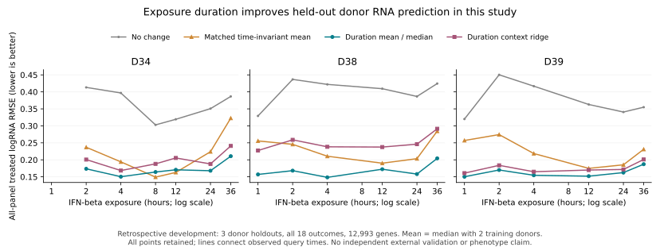

# Native duration-aware RNA prediction

**PASS for the declared retrospective development comparison; independent external
validation remains open.** The native duration mean improves all-panel RMSE by
**55.71% versus no change** and **24.83% versus a matched time-invariant mean**.
This uses all three donor holdouts and all 18 treated donor-times from the already
inspected GSE226572 study. It does not overturn the earlier external-transfer
failure or establish general biological-outcome prediction.



## Complete experiment

The [frozen protocol](PROTOCOL.md) reuses all 126,633 cells admitted by the prior
initial QC, all 24 raw libraries and all 36,601 measured genes. No new filtering,
cell-type assignment or count extraction was performed. Every fold trains on the
other two donors' pooled control and six treated profiles, then predicts from
only the held-out donor's pooled control and its six exposure hours. All cultures
lasted 36 hours; treatment exposure was staggered. The unchanged shared-symbol
panel contains 12,993 genes, with full-source RNA normalization before projection.
See the [original source qualification](../GSE226572/README.md) for provenance,
QC boundaries and differences from the author's later curated cell collection.

Each training donor has a zero-response control anchor and its observed treated
RNA responses. Interpolation is linear in log1p(hours), followed by equal-donor
mean/median or training-control context ridge with fixed alpha=1. The matched
invariant baseline averages all six nonzero responses within each training donor,
then averages donors and applies that response at every time. There was no tuning
of the time transform, regularization, panel or thresholds after scoring.

| Predictor | Equal-donor, equal-time RMSE | Worse than no change | Worse than matched invariant mean |
| --- | ---: | ---: | ---: |
| No change | 0.379073 | — | 18/18 |
| Matched time-invariant mean | 0.223375 | 0/18 | — |
| Duration mean | **0.167905** | **0/18** | 2/18 |
| Duration median | 0.167905 | 0/18 | 2/18 |
| Duration context ridge | 0.207999 | 0/18 | 7/18 |

The primary gate required at least 5% improvement against **both** baselines:
**PASS**. The secondary ridge-versus-duration-mean/no-change gate: **FAIL**.
Mean and median coincide with two training donors. Duration mean beats the
matched invariant mean in each donor's six-time average, but loses at D34's
8- and 12-hour outcomes. All results, including those failures, are retained.

| Held-out donor | No change | Matched invariant mean | Duration mean | Duration ridge |
| --- | ---: | ---: | ---: | ---: |
| D34 | 0.361566 | 0.214959 | 0.172911 | 0.198625 |
| D38 | 0.401386 | 0.231650 | 0.168064 | 0.249962 |
| D39 | 0.374268 | 0.223517 | 0.162740 | 0.175410 |

Nominal 95% future-donor Student-t intervals use two donors (one degree of freedom).
Response coverage is **93.58–96.14%** and treated-expression coverage is
**93.59–96.17%**. Mean interval width is **2.48–3.62** in response logRNA units
and **2.14–3.05** after treated-expression clipping. Width, unavailable genes,
interpolation error, query-control uncertainty and three-donor replication limit
interpretation; this is not evidence of general calibration. At zero duration,
exactly constant zero responses have unavailable intervals rather than certainty.

## Native contract and verification

Owners: [model](../../../../Sources/NumiVivoKit/Omics/VivoDurationPerturbation.swift)
and [artifact lifecycle](../../../../Sources/NumiVivoKit/Omics/VivoDurationPerturbationIO.swift).
`VivoDurationPlan` requires explicit condition-to-hour assignments, control,
perturbation and feature identities, mapping and provenance. Every donor needs one
pooled control and at least two distinct nonzero exposures. The query supplies
control-only counts and requested hours; training donor reuse, namespace/unit or
population mismatch, missing panel features and temporal extrapolation are rejected.
No dose effect is inferred from an exposure-hour field.

The model requires at least two donors. The shared reader caps each operation at
128 pseudobulk profiles and four million matrix entries; each training donor needs
at least three profiles. Plans permit 2–63 declared exposures and queries 1–64
distinct hours, subject to additional fit-work and output-size bounds. It does not
densify individual cells × genes. Predictions return full-library totals, unclipped and
applied responses, clipped treated logRNA, implied panel CPM subtotal and interval
availability. Artifacts snapshot source H5AD, retain identities and receipts,
refuse overwrite, publish transactionally and reconstruct the model from the
source instead of trusting stored coefficients. The fixed-response owner is
unchanged apart from sharing its existing internal I/O helpers.

Validation on physical Apple M4, 24 GiB, macOS 26.6, Swift 6.3:

- Scoped product build and **12 tests in two suites PASS**, including legacy
  perturbation checks, interpolation, donor balance, full denominators and input rejection.
- **15 real CLI commands PASS**: three fits, three model reconstructions,
  three predictions, three prediction reconstructions and three repeats.
  Every repeated prediction report is byte-identical.
- Every training aggregate count matches the retained original native aggregate.
  Independent NumPy/SciPy reconstruction checks every point and bound: maximum
  point discrepancy **4.01e-13**, interval-bound discrepancy **7.11e-15**.
- All five repeated scoring files are byte-identical. All 90 method/outcome scores,
  36 interval records and 72 independent native point comparisons are retained.
- **Eight CLI rejection checks PASS**, including a modified coefficient with an
  updated result hash: reconstruction still rejects it. Failed query publications
  leave no destination or temporary output.

The 15 commands took 12.92 seconds in total, with maximum reported process RSS
283,590,656 bytes; these operate on already qualified aggregates and include no
raw import/QC time. This is a scoped CPU execution receipt, not an end-to-end
speed claim, Metal qualification or a full-package test result. An initial
compile failed on Swift operator spacing; its log is retained with the correction.

Executable SHA-256: `d59cf0ffbb52c4dbda04218c40a9ba0e71a182f52d14f127151a9f474c8a4858`.
Input freeze: `04678a877c53a495434e887b251baab558ac9670825222031e7270dfd9247236`.
Prediction freeze: `25dd52228c6c237859a8c6a26095662f1948313905ad29eea62b48b0d6b14c2c`.

## Reproduction and retention

From the repository root, using an environment with AnnData, NumPy and SciPy
(the plot additionally needs Matplotlib), and the retained complete GSE226572 study:

```sh
export NUMIVIVO_HDF5_LIBRARY=/absolute/path/to/libhdf5.dylib
export OPENBLAS_NUM_THREADS=1 OMP_NUM_THREADS=1
DURATION_STUDY=/absolute/path/to/new-duration-study
GSE_STUDY=/absolute/path/to/numivivo-gse226572-20260911
mkdir -p "$DURATION_STUDY"
bash Tools/Omics/H5AD/build.sh "$DURATION_STUDY/build" --with-cli
bash Tools/Omics/PerturbationPrediction/Duration/test.sh "$DURATION_STUDY/build"
python Tools/Omics/PerturbationPrediction/Duration/prepare.py --source-study "$GSE_STUDY" --study "$DURATION_STUDY"
python Tools/Omics/PerturbationPrediction/Duration/run.py --study "$DURATION_STUDY" --binary "$DURATION_STUDY/build/numivivo-omics"
python Tools/Omics/PerturbationPrediction/Duration/score.py --study "$DURATION_STUDY" --out "$DURATION_STUDY/scores"
python Tools/Omics/PerturbationPrediction/Duration/failure_checks.py --study "$DURATION_STUDY" --binary "$DURATION_STUDY/build/numivivo-omics"
```

The [evidence manifest](evidence/2026-09-11/manifest.json) binds the exact native
snapshots, complete aggregate inputs, all prediction/outcome vectors, commands,
failures, recipe/source texts and executable. `results.tar.gz` stores repeated
bytes once by content. The prior experiment retains the raw 24-library sources
and every-barcode QC masks; their dependency manifest is hash-bound here.

```sh
python Tools/Omics/PerturbationPrediction/Duration/archive.py verify --archive Tools/Omics/PerturbationPrediction/Duration/evidence/2026-09-11/results.tar.gz
python Tools/Omics/PerturbationPrediction/Duration/archive.py restore --archive Tools/Omics/PerturbationPrediction/Duration/evidence/2026-09-11/results.tar.gz --out /absolute/path/to/new-restored-duration-study
```

All three restored models and predictions are reconstructed before redundant
expanded snapshots are removed. The archived native executable preserves the
exact implementation identity; another build or OS does not inherit its receipts.

## What this establishes

Exposure time is useful information for estimating average RNA response for a
held-out donor within this experiment. It does not establish that the model will
transfer to new studies, doses, disease states, cell types or tissues. The data
were already inspected before choosing this repair; a new independent experiment
with a frozen temporal model and outcome contract is the next validation gate.
The previous Kang-to-GSE226572 fixed-response failure remains unchanged. No
RNA-to-protein, immune recognition, phenotype or clinical-benefit claim follows.
