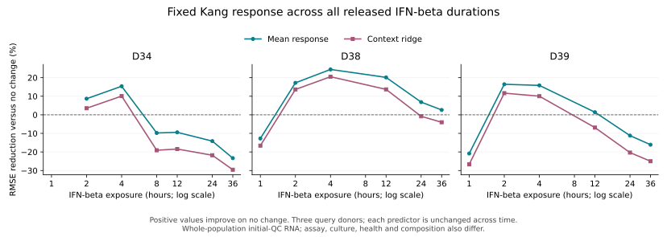

# Complete external PBMC duration-transfer experiment

**The native predictor missed both frozen prediction targets.** Across all 18
released donor/time observations, mean response reduces error by 2.00% versus no
change, below the required 5%. It is worse than no change in 8/18 cases. Context
ridge is worse in 11/18 and fails its comparison with both simpler baselines.
Every native point estimate and interval bound passes independent reconstruction.

This is actual native execution on a separately collected public experiment,
not a parse of an upstream model's predictions. It adds an external limit on
current RNA-response transfer. It does not qualify general biological outcomes.
The [protocol](PROTOCOL.md) was frozen before any query counts were downloaded.



## Complete source and endpoint

[GSE226572](https://www.ncbi.nlm.nih.gov/geo/query/acc.cgi?acc=GSE226572) is the
healthy-donor IFN-beta subseries of the
[de Cevins et al. study](https://pmc.ncbi.nlm.nih.gov/articles/PMC10772457/).
Primary SOFT metadata identifies three donors, D34/D38/D39, and 24 libraries.
Each donor has two zero-hour libraries and six stimulated libraries. Exposure
varies from 1 to 36 hours; not every donor has every time. IFN-beta 1a was added at
1000 U/mL, with staggered stimulation so all samples, including unstimulated
controls, spent 36 hours in culture. These roles are explicit in primary metadata.

All 24 original raw 10x H5 files are retained, totaling1,159,356,202 bytes. The
complete source contains 54,333,430 raw barcodes and 510,726,115 stored count
records. Raw barcodes are not all cells. Frozen initial QC admits 126,633 cells:
at least 750 detected genes and at most 20% of RNA counts in exact source symbols
starting `MT-`. All 36,601 source features are labelled gene expression; 13 have
that mitochondrial prefix. Both count conditions use exact integer arithmetic.

Every raw sparse record is validated for domain, bounds, ordering and uniqueness.
Every barcode's total, detected-gene count, mitochondrial count and inclusion
mask is retained. All 286,664,420 admitted count records match the consolidated
H5AD exactly. Native aggregation matches independent sums for all 21 donor/time
groups, including pooled counts from both control libraries of each donor. All
cell identifiers, sample assignments and group memberships match.

This endpoint retains every barcode passing the stated initial count QC. It does
**not** reproduce the authors' later cluster exclusions, curated 115,503-cell
object or cell-type assignments. It supplies no new singlet or cell-identity
qualification. The whole-population RNA endpoint includes changes in composition,
viability and preparation as well as expression. It is distinct from the earlier
B-cell experiments. The large processed Seurat object is not needed for this
frozen endpoint; original raw counts and every QC decision remain available.

## Frozen predictions and outcomes

Training uses every 24,673 source-admitted Kang cell, all eight donors and both
conditions, aggregated into 16 source-qualified population profiles. No cell type
is selected. Query inputs contain only each new donor's pooled unstimulated
counts. Native fitting learns all scales, contexts and responses from Kang alone.

The output panel comprises 12,993 exact unique shared symbols; 11,652 satisfy the
training-only context-feature criteria. Original Ensembl identifiers, symbols,
ambiguous/unmatched features and every full-source RNA denominator are retained.
Shared symbols do not establish a common genome annotation release.

The four unchanged native baselines predict treated log1p(CPM). There is no
query-outcome fitting or temporal covariate: the source's six-hour response is
transferred unchanged to each available query time. Thus this experiment tests
a fixed response under duration and context shifts, not a learned time course.
Disease status, dose, culture, assay, source QC and composition also differ.

| Method | Equal-donor, equal-within-donor-time RMSE | Donor/time cases worse than no change |
| --- | ---: | ---: |
| No change |0.379073|—|
| Mean response |0.371477|8/18|
| Median response |0.370838|8/18|
| Context ridge |0.395699|11/18|

The primary requirement was a mean-response RMSE reduction of at least 5%; the
observed 2.0038% does not pass. The secondary ridge requirement also fails. Median
is retained as a baseline; its score is not used to replace the declared primary.

| Donor | No-change RMSE | Mean-response RMSE | Ridge RMSE |
| --- | ---: | ---: | ---: |
|D34|0.361566|0.378678|0.403669|
|D38|0.401386|0.358674|0.380161|
|D39|0.374268|0.377080|0.403268|

The complete archive includes all 72 method/donor/time scores and all 18 outcome
vectors, with each source library linked. One-hour results have two donors,
eight-hour results have one, and 2/4/12/24/36-hour results each have three. The
primary calculation weights donors equally after averaging their available times;
it does not count 18 observations as 18 independent donors or select a favorable
window. Lines in the figure connect observed times only, without fitted smoothing.

Nominal 95% future-donor mean-response intervals use the eight training donors
only. Coverage ranges from 85.3690% to 95.4514% over all donor/time cases, in both
unclipped response and clipped treated-expression spaces. Every width, missed
side and unavailable feature is retained. This range does not establish uniform
95% calibration, a temporal interval model, simultaneous coverage or uncertainty
in the observed control. Three query donors cannot establish broad reliability.

## Execution and verification

Nine native commands completed: two whole-population aggregations and their
reconstructions, model fitting/reconstruction, prediction/reconstruction, and a
repeated prediction. Repeated prediction report bytes are exact. Independently
repeated scoring reproduces all five output files byte-for-byte.

Every native prediction agrees with NumPy/scikit-learn reconstruction within
2.576e-14; interval bounds agree with the independent Student-t calculation within
1.777e-15. Maximum dual-coefficient difference is 4.448e-14. Feature selection,
normalization, training-only scaling, class-free population grouping, clipping,
variance availability and implied CPM totals are checked explicitly.

The physical execution host is an Apple M4 laptop with 24 GiB RAM and macOS 26.6.
Maximum native RSS is 423,018,496 bytes for aggregation and 146,407,424 bytes for
prediction work. These are operational observations, not controlled comparative
performance, Metal or full-application qualification. Independent tools are
Python 3.12.14, AnnData 0.13.3.post0, NumPy 2.5.3, SciPy 1.18.1 and scikit-learn 1.9.0.

No native source changed. The existing executable SHA256 is
`9d5de14bb4e02f5d6a8db46df95d1bfc9b27205119afca4084139608fb6e0537`;
HDF5 SHA256 is
`a00ffbf8ab94ad81f67231a1ae01df748689e1c35a3615a57f88f4710b8d213e`.
The inspected owner revision is `46ac5f0879828db28f514f50104ecb19e85967eb`;
the executable is the prior qualified build, with source bindings retained by
the [cross-study reference qualification](../../ReferenceMapping/CrossStudy/README.md#reproduce-and-retain).
Prediction input freeze:
`ba819df2a583032daf37c59fc01c0724b6d87373c3e26323e3c108d145e51e0d`.
Pre-scoring prediction freeze:
`44ca1ca3b25b9c8576d80b9c6cd86650b3fd449261e8a8d78f720e9efd5c730a`.

## Reproduce and retain

The scripts use explicit `--study`, `--binary` and output arguments; run `--help`.
The order is [download](download.py), [source preparation](prepare.py),
[native aggregation and source comparison](run_aggregation.py),
[prediction preparation](prepare_prediction.py), [native prediction](run_prediction.py),
[independent scoring](score.py), repeated scoring, and [plotting](plot.py).
Set `NUMIVIVO_HDF5_LIBRARY` to the qualified library. Keep query counts out of model
fitting and do not modify the frozen protocol or plans after inspecting outcomes.

[Compact evidence](evidence/2026-09-11/manifest.json) retains complete native
metadata, plans, receipts, models, predictions and logs in a content-deduplicated
archive, plus all outcome vectors, QC summaries, source metadata, feature maps,
recipes and scoring. Full raw H5 files, every-barcode QC arrays and prepared
H5ADs remain under `/Users/home/numivivo-gse226572-20260911`, explicitly bound by
size and SHA256. Original H5AD snapshots are restored from those exact retained
inputs rather than duplicated in Git or on the nearly full Mac mini.

```sh
python3 Tools/Omics/PerturbationPrediction/GSE226572/archive.py restore \
  --archive Tools/Omics/PerturbationPrediction/GSE226572/evidence/2026-09-11 \
  --study /path/to/numivivo-gse226572-20260911 \
  --out /new/path/to/restored
```

Use the recorded native executable to verify each restored aggregation, model
and prediction. Preserve original source files when removing reproducible native
working copies. Native restoration was checked before cleanup.

## Implication for the goal

Available control RNA and a response learned in another study can carry some
predictive signal, but they did not meet this experiment's useful-improvement
target across the complete new cohort. The current model does not represent
duration, and its errors vary by donor and time. That motivates an explicit
duration/context model and separate validation; this experiment cannot prove
which biological difference caused each error or that adding time alone fixes it.
These scored observations are now development data for any proposed repair.

The separate GSE181897 treatment-code gate and Adamson experimental-role gate
remain unresolved. This completed whole-population experiment does not replace
those planned B-cell/target tests. The broader goal still needs reliable context
transfer, calibrated uncertainty, biological annotation/integration, multimodal
and cross-scale validation; see the [prediction assessment](../../../../Documentation/BiologicalPrediction.md).

The subsequent [native temporal interpolation experiment](TemporalInterpolation/README.md)
uses this now-inspected cohort for donor-and-time-held-out development. All three
donor gates pass against two baselines, while two individual observations lose to
the training mean. It does not replace the original failed cross-study test.
