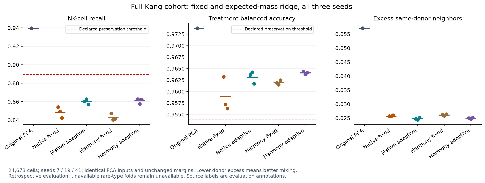

# Expected-mass ridge integration

Integration supports an explicit ridge penalty proportional to the expected
cluster/batch mass. Fixed ridge remains the default. Biological acceptance is
separate from the numerical implementation and replay checks. The adaptive mode
passes the Hagai response gates but still fails Kang NK-cell preservation in all
three native and all three reference runs; general multi-donor qualification is open.



Use the existing `singlecell-pca-integrate` and verification commands with:

```json
{
  "schemaVersion": 1,
  "inputKind": "fitted",
  "integration": {
    "covariate": "donor",
    "clusters": 100,
    "diversity": 2,
    "ridge": 0.2,
    "ridgeScaling": "expectedClusterBatchMass",
    "temperature": 0.1,
    "maximumIterations": 10,
    "relativeTolerance": 0.01,
    "seed": 7,
    "maximumWork": 2000000000
  }
}
```

When `ridgeScaling` is omitted, `ridge` is the fixed penalty and its default is
1. With `expectedClusterBatchMass`, `ridge` is the coefficient alpha. Selecting
the mode alone does not change that default coefficient: supply `0.2` explicitly
to reproduce this protocol. Unknown modes and nonpositive coefficients reject.

For cluster c and covariate level b, the penalty is
`lambda[c,b] = alpha * sum_i R[i,c] * N_b / N`. The intercept remains unpenalized.
Only levels above the existing observed-mass/proportion cutoff enter the fit;
clusters with fewer than two active levels remain uncorrected. Every correction
is fitted to and subtracted from the original PCA coordinates. The report retains
the final cluster-by-level penalties and identifies the method as
`diversity-soft-clustering-expected-mass-ridge-Double-v1`. The fixed path omits
this new optional report field and keeps its prior numerical operations.

This coefficient and formula follow the default automatic lambda in the pinned
[harmonypy 2.0.0 source distribution](https://pypi.org/project/harmonypy/2.0.0/).
Its archive SHA256 is
`98c18954781aec9a82aaec3cde3764d89fd2ef93e84ece6724bc0f25b37244ed`;
`harmony.hpp` defines `find_lambda`, and `harmony.cpp` passes expected cluster/batch
mass into correction. Native initialization and Double arithmetic remain
independent. Matching the formula does not imply matching the reference trajectory.

The shared resident/file-backed solver, parent reconstruction, immutable replay,
confounding rejection and transductive query semantics remain those documented
in [FILE_INTEGRATION.md](FILE_INTEGRATION.md). A changed executable requires fresh
PCA inputs; old outputs are used only as independently compared numerical oracles.

## Diagnosis and protocol

The retained fixed-ridge Kang NK-cell recall failure also appears with a
class-balanced linear classifier and an exact 30-neighbor classifier trained on
other donors. Across the three native seeds, donor-held-out NK recall is
0.8424–0.8541 with the original classifier and 0.7702–0.7861 with the neighbor
classifier, compared with 0.9397 and 0.9375 before correction. The donor-balanced
fraction of NK annotations in NK neighborhoods falls from 0.8735 to
0.6973–0.7075. This supports a representation-level loss of separation; it does
not establish that the source annotations are biological ground truth.

The adaptive protocol was declared before adaptive results, with alpha 0.2 and
seeds 7, 19 and 41. It retains the original accuracy/recall/program margins,
missing strata and failed global condition-erasure control. Kang and Hagai were
already inspected, so their adaptive results are retrospective development and
regression evidence. There is no parameter grid search or unseen-validation claim.

Independent Ding PBMC source discovery acquired the original GSE132044 count,
cell and gene files: the declared matrix is 33,694 features by 44,615 cells with
39,622,839 entries. The 584 Smart-seq2 cells use read counts; the other 44,031
cells use UMI-method counts and must retain that unit distinction. The
[source portal](https://singlecell.broadinstitute.org/single_cell/study/SCP424/single-cell-comparison-pbmc-data)
describes sampled normalized data and individual-analysis author annotations,
separately from Harmony-derived annotations. Its annotation download requires
sign-in and the original cell labels have not been acquired. No source labels
are regenerated or assumed, and no independent biological evaluation is claimed.
PBMC1 and PBMC2 identify experiments; individual donor identity requires further
source verification. Raw-file hashes and this pending gate are retained.

## Measured outcomes, 2026-09-09

| Native metric | Original Kang | Adaptive Kang, three seeds | Original Hagai | Adaptive Hagai, three seeds |
| --- | ---: | ---: | ---: | ---: |
| Same-donor excess within type/condition | 0.057125 | 0.024354–0.025120 | 0.487372 | 0.184429–0.184477 |
| Cell-type balanced accuracy | 0.910778 | 0.907871–0.927473 | unavailable | unavailable |
| NK-cell recall | 0.939737 | **0.856798–0.862774: fails** | unavailable | unavailable |
| Treatment balanced accuracy | 0.973819 | 0.961712–0.964222 | 0.981466 | 0.999575–0.999690 |
| Program Spearman | 0.940498 | 0.938941–0.939012 | 0.819807 | 0.817014–0.817180 |
| Within-stratum program Spearman | 0.587057 | 0.586872–0.604926 | 0.483682 | 0.463626–0.464162 |

Kang loses 7.70–8.29 percentage points of NK recall against a maximum accepted
loss of five. The independent automatic-lambda Harmony runs also fail, with
recall 0.857573–0.862860. All other measured preservation margins pass, but the
four missing rare-type treatment folds remain incomplete. The original failed
global treatment-erasure control remains failed; the separately qualified
type-conditioned erasure control from the fixed-ridge archive remains diagnostic.

Adaptive native NK recall under the balanced linear classifier is
0.861384–0.866328, and under the exact donor-held-out 30-neighbor classifier it is
0.796298–0.809847. NK neighborhood fractions are 0.720424–0.730001, compared with
0.873465 before correction. All original classifier results are reproduced
exactly in the diagnostic harness. The modest improvement over fixed ridge does
not resolve the loss of separation.

Hagai passes every applicable gate in all six adaptive native/reference runs.
It retains more within-stratum response correlation than fixed ridge, while
removing less donor excess (fixed native excess was approximately 0.142).
Within-stratum program correlation still falls by roughly 0.020; passing a margin
does not mean complete signal preservation. Hagai has one reported QC stratum
and no source per-cell type labels, so it does not validate diverse cell types.
Both fixed and adaptive modes reject the complete, disconnected Baron
donor/disease design without removing cells to force eligibility.

## Numerical validation and reproducibility

The release executable SHA256 is
`a56a056349aac2d2463ad56b5a8260257186cf6388a021f77d5bb0bc38566c8d`.
Release and scoped owner builds pass on the M4 Pro Mac mini, with Swift 6.3.3
and macOS 26.6. All 516 tracked files under `Sources/` in the manifest match
the local publication source. The test run passes 89 tests in 27 suites.
The 60 CLI lifecycle checks include 16 expected rejections, adaptive fitted/query
replay, and rehashed penalty-report corruption rejection. All 29 full-cohort
commands complete, including the two expected Baron rejections.

Fresh PCA score bits and metadata match their frozen counterparts. All six
fixed-ridge results retain every score, membership and assignment-score byte
and the complete report bytes. The extended independent NumPy checker also
reconstructs all six prior fixed results. Adaptive dense normal-equation solves,
expected-mass penalties, objectives and stopping diagnostics reconstruct with
maximum coordinate errors 9.60e-14 (Kang) and 8.40e-14 (Hagai).

Adaptive publication takes 12.83–13.91 seconds with 281,559,040–285,655,040 bytes
peak RSS on full Kang, and 18.01–18.46 seconds with 261,357,568–261,832,704 bytes
on full Hagai. These single-run lifecycle observations include reconstruction
and serialization. Python reference and evaluation work ran on the laptop;
there is no paired cross-host speed comparison, Metal acceleration result or
million-cell qualification.

`run_adaptive_integration.py` owns fresh native runs, unchanged fixed-byte
comparisons and full-cohort rejection. `check_adaptive_integration.py` uses the
same frozen-cohort inputs and margins after checking every PCA value and metadata
axis, and runs pinned automatic-lambda reference correction. The shared
`check_full_integration.independent` reconstructs fixed or vector-penalty normal
systems independently. `diagnose_integration_preservation.py` retains predictions,
confusions, train-only scaling and fitted classifier parameters for every donor.

The [evidence manifest](evidence/2026-09-09-adaptive-integration/manifest.json)
maps logical file paths to deduplicated gzip objects with hashes for both stored
and uncompressed bytes. `archive_adaptive_integration.py --verify --out ARCHIVE`
checks every object. Decompress each object's bytes to its logical path to
restore evidence. Original H5AD aliases and the exact executable remain external,
with hashes and canonical paths recorded; native replay additionally needs those
inputs. Human-readable checks and the figure accompany the archive. Source
discovery, initial harness parse/transfer errors and final successful checks are
kept distinct from native execution and biological failures.
