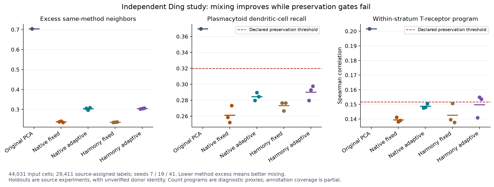

# Independent Ding PBMC integration benchmark

All six native fixed/adaptive runs improve method mixing but fail the declared
per-type recall and within-stratum program-preservation gates. All six independent
harmonypy reference runs also fail per-type preservation. This extends the retained
Kang failure to a separate study; general biological integration qualification remains open.



## Source and count boundaries

The [Ding et al. study](https://doi.org/10.1038/s41587-020-0465-8) provides
[GSE132044 original counts](https://www.ncbi.nlm.nih.gov/geo/query/acc.cgi?acc=GSE132044)
and [SCP424 study annotations](https://singlecell.broadinstitute.org/single_cell/study/SCP424/single-cell-comparison-pbmc-data).
The portal's raw-file download requires sign-in. Its documented public
[visualization API](https://singlecell.broadinstitute.org/single_cell/api/v1)
separately exposes study-level CellType, Experiment and Method values. The frozen
three-field snapshot was fetched twice without authentication and matched exactly.
CellType is the source individual-analysis annotation, separately described by the
portal from Harmony-derived joint annotations. It is evaluation evidence, not a
new label predicted by this implementation.

The input retains all **44,031 UMI-method cells**, all **33,694 original features**
and **38,102,066 nonzero counts**. Python H5AD reload checks preserve every retained
count and both axes. The original matrix includes another 584 Smart-seq2 read-count
cells: these remain in the archived external raw-source identity and are excluded
from this UMI input because their count unit differs. Portal normalized expression
is not substituted for original counts. PCA uses sparse counts, 2,000 requested
variable features and 20 components, with the previously fixed Kang fit options.

Source labels join by experiment, literal publisher method, and exact DNA barcode,
retaining plate/array tags. The preparation script spells out reversible prefix,
separator and tag aliases for CEL-Seq2, Seq-Well and inDrops. Both source-key
uniqueness and injective matches are checked. No fuzzy, expression-derived or
row-order match is used. The full alignment and unmatched lists are retained.
Of 31,021 portal rows, 29,457 match GEO UMI cells, 1,038 UMI annotations have no
exact GEO match, and 526 Smart-seq2 annotations remain outside this UMI join.
Of retained cells, **29,411 have an assigned source type (66.80%)**, 46 are source
“Unassigned”, and 14,574 lack a matching annotation. All cells enter correction
and the full-neighbor program readouts; only assigned source labels enter
classifiers and type-stratified metrics. Annotation coverage varies by library
and limits the conclusions; it is not an independent experimental ground truth.

| Experiment / method | Assigned | Unassigned | Unavailable |
|---|---:|---:|---:|
| pbmc1 / 10x Chromium (v2) A | 3,182 | 0 | 1,990 |
| pbmc1 / 10x Chromium (v2) B | 3,044 | 0 | 13 |
| pbmc1 / 10x Chromium (v3) | 3,215 | 0 | 818 |
| pbmc1 / CEL-Seq2 | 251 | 0 | 6 |
| pbmc1 / Drop-seq | 2,873 | 0 | 1,810 |
| pbmc1 / Seq-Well | 3,176 | 46 | 1,903 |
| pbmc1 / inDrops | 3,222 | 0 | 2,962 |
| pbmc2 / 10x Chromium (v2) | 3,362 | 0 | 0 |
| pbmc2 / CEL-Seq2 | 273 | 0 | 34 |
| pbmc2 / Drop-seq | 3,358 | 0 | 3,054 |
| pbmc2 / Seq-Well | 549 | 0 | 364 |
| pbmc2 / inDrops | 2,906 | 0 | 1,620 |

The native batch covariate retains eight literal Method values across twelve
libraries; these are not eight distinct biological technologies. Experiment
(`pbmc1`, `pbmc2`) remains the native condition/design stratum and biological-sample
identifier: the paper reports one biological sample per experiment. No treatment,
health state or donor identity is inferred. Donor IDs remain absent. A full-input
attempt to correct `donor` rejects with exit 65 and publishes no destination.
The mapping omits `groupColumn`, so CellType annotations never become native
correction groups. Classifier splits hold out an experiment, not a known donor.
Correction itself is transductive and is not fitted on training cells alone.

## Declared evaluation

The retained protocol was written before Ding PCA/correction. Both modes use
100 clusters, diversity 2, temperature 0.1, at most 10 iterations and relative
tolerance 0.01, with seeds 7, 19 and 41. Fixed ridge is 1; adaptive expected-mass
ridge uses alpha 0.2. The independent harmonypy 2.0.0 runs use lambda 1 or automatic
lambda with alpha 0.2, four inner iterations, block size 0.05, cluster tolerance
0.001, outer tolerance 0.01, cutoff 1e-5 and one core. These settings were carried
forward, without selecting a Ding parameter grid or relaxing thresholds.

Evaluation uses exact 30-neighbor searches over every retained cell, stable
source-index tie breaking, and 64-row distance blocks with four workers.
Mixing compares same-method neighbor fraction with the available method frequency
inside source-type/experiment strata, then averages by experiment and method.
Cells in strata smaller than 31 would be explicitly unavailable, not evaluated
with a smaller k. None were missing in these runs.

The primary classifier is experiment-held-out StandardScaler plus logistic
regression (C=1, lbfgs, maximum 2,000 iterations). Fits converge and all source
classes occur in both folds. Class-balanced logistic regression and exact
held-out-experiment 30-neighbor voting are retained as separate diagnostics.
Every fit, coefficient, confusion matrix, prediction and neighbor index is saved.

Two analyst-declared diagnostic programs use equal-weight mean log1p counts per
10,000: NK-associated (NKG7, GNLY, KLRD1) and T-receptor (CD3D, CD3E, TRAC).
Spearman correlation compares each measured program with its neighbor-smoothed
value globally within experiment and within source-type/experiment strata.
These proxies may contain technical measurement effects; they are not exclusive
lineage identities, causal effects or treatment responses. Their failure is a
failure of the predeclared acceptance proxy, not proof of biological damage.

Acceptance requires improved method mixing, at most 0.02 balanced-accuracy loss,
at most 0.05 recall loss for every source type, and at most 0.05 loss for both
program correlations at both scopes. A source-type-centering erasure control
reduces balanced accuracy from 0.660902 to 0.106910, exceeding the required
0.10 loss. Unknown and unassigned cells stay present in that control.

## Measured outcomes

| Representation | Seed | Same-method excess ↓ | Balanced accuracy | pDC recall | Within-stratum T-receptor Spearman |
|---|---:|---:|---:|---:|---:|
| Original PCA | 7 | 0.704231 | 0.660902 | 0.369736 | 0.201722 |
| Native fixed | 7 | 0.238637 | 0.665242 | 0.258518 | 0.141161 |
| Native fixed | 19 | 0.241891 | 0.661179 | 0.252009 | 0.138143 |
| Native fixed | 41 | 0.235525 | 0.666376 | 0.273224 | 0.139000 |
| Native adaptive | 7 | 0.305348 | 0.671070 | 0.279733 | 0.147638 |
| Native adaptive | 19 | 0.297369 | 0.668187 | 0.289537 | 0.148010 |
| Native adaptive | 41 | 0.308986 | 0.671086 | 0.284635 | 0.150521 |
| Reference fixed | 7 | 0.234649 | 0.663189 | 0.276519 | 0.139621 |
| Reference fixed | 19 | 0.236010 | 0.659518 | 0.266715 | 0.150588 |
| Reference fixed | 41 | 0.237312 | 0.666918 | 0.276519 | 0.137616 |
| Reference adaptive | 7 | 0.302878 | 0.669245 | 0.279733 | 0.140843 |
| Reference adaptive | 19 | 0.304903 | 0.668082 | 0.292832 | 0.154890 |
| Reference adaptive | 41 | 0.306936 | 0.674810 | 0.297734 | 0.153632 |

All twelve runs pass mixing, overall balanced accuracy, and global program gates.
All twelve fail the per-type recall gate, including plasmacytoid dendritic cells
(pDCs; 163 labeled cells, 102 in pbmc1 and 61 in pbmc2). Native fixed runs also
exceed the allowed loss for CD16+ monocytes and cytotoxic T cells; adaptive seed 7
also exceeds it for cytotoxic T cells. All six native runs fail the within-stratum
T-receptor gate (minimum 0.151722). Reference adaptive seeds 19 and 41 pass that
program gate; every other reference run fails it. No mixing, training-class or
program strata are missing, but source-label coverage remains incomplete.
The prior Kang NK-cell failure is unchanged. Improving Ding NK recall from its
low baseline does not repair the separate Kang failure.

## Numerical checks and evidence

The unchanged native executable from commit
`abf94f706d3bd527fc17b18d8e0040afbbcbbfd5` produced a fresh Ding PCA and six
integrations, each replay-verified: 13 successful commands, plus the expected
unknown-donor rejection. Independent NumPy reconstruction checks the correction,
penalties, objective and stopping logic; the maximum correction discrepancy
across all six runs is 2.99e-13. Every transferred non-H5AD artifact is checked
against the remote byte inventory. Omitted H5AD aliases match the canonical
prepared source. Disposable remote corrected copies were removed only after
exact backup, inventory, hash and open-handle checks; source/PCA remain retained.

One initial evaluation-input serialization failed before reference correction:
pandas strings became NumPy object arrays, correctly rejected by loading with
pickle disabled. Explicit Unicode serialization plus immediate reload/equality
checks fixes the producer. The baseline/control recomputation matches every
previous metric except timing, all fits, and all neighbor/prediction arrays
exactly. The failed initial inputs and error log remain marked as history;
only `evaluation-inputs/` in the final archive is the valid reference input.

M4 Pro observations: PCA took 13.60 seconds with 265,764,864-byte peak RSS;
correction took 21.87–23.70 seconds with peak RSS at most 428,834,816 bytes,
and replay took 22.14–24.32 seconds. These single-run native observations do not
establish same-host scverse speed, million-cell scaling or Metal acceleration.
This benchmark changes no production source; its six Python scripts compile.
The preceding native build/test qualification remains associated with its exact
owner commit and executable, not rerun or relabeled as a new implementation.

The [manifest](evidence/2026-09-09-ding-integration/manifest.json) records every
logical artifact, compressed and raw hash, and external input identity. The
[archive check](evidence/2026-09-09-ding-integration/archive-checks.json) verifies
all stored objects. Readable [native evaluation](evidence/2026-09-09-ding-integration/native-evaluation-checks.json),
[reference evaluation](evidence/2026-09-09-ding-integration/reference-evaluation-checks.json),
[annotation provenance](evidence/2026-09-09-ding-integration/annotation-checks.json),
and [protocol](evidence/2026-09-09-ding-integration/protocol.json) separate
numerical success, source coverage and failed biological acceptance.

## Reproduction

Use the pinned Python environment (NumPy 2.5.3, SciPy 1.18.1, anndata
0.13.3.post0, scikit-learn 1.9.0, harmonypy 2.0.0). Native execution requires
the recorded executable and HDF5 library hashes in the manifest. Restore raw
GEO files and the prior Kang fit plan; the exact final Ding fit is also retained.
Commands below use new output directories and the same isolated Mac mini route.
The remote runner deliberately disposes only its own verified backed-up corrected
runs to bound disk use. It preserves the canonical source and original PCA.

```sh
python fetch_ding_annotations.py --out WORK/annotations
python prepare_ding_integration.py --source GEO --annotations WORK/annotations \
  --base-fit KANG_FIT --out WORK/prepared
python run_ding_integration.py --host macmini --binary BINARY --hdf5 HDF5 \
  --remote-root REMOTE_WORK --prepared WORK/prepared --out WORK/native
OPENBLAS_NUM_THREADS=1 OMP_NUM_THREADS=1 python evaluate_ding_integration.py \
  --stage prepare --prepared WORK/prepared --native WORK/native --out WORK/evaluation-inputs-final
OPENBLAS_NUM_THREADS=1 OMP_NUM_THREADS=1 python evaluate_ding_integration.py \
  --stage native --prepared WORK/prepared --native WORK/native \
  --inputs WORK/evaluation-inputs-final --out WORK/native-evaluation
OPENBLAS_NUM_THREADS=1 OMP_NUM_THREADS=1 python evaluate_ding_integration.py \
  --stage reference --prepared WORK/prepared --native WORK/native \
  --inputs WORK/evaluation-inputs-final --out WORK/reference-evaluation
python check_ding_source_scope.py --host macmini --binary BINARY --hdf5 HDF5 \
  --remote-root REMOTE_WORK --protocol WORK/prepared/protocol.json --out WORK/source-scope
python plot_ding_integration.py --root WORK --out WORK/figure
python archive_adaptive_integration.py --verify --out evidence/2026-09-09-ding-integration
```

Native commands, plans, source joins and complete output receipts are retained.
Integration repair must now address rare populations and local state preservation
across both studies; tuning mixing alone cannot satisfy these unchanged gates.
