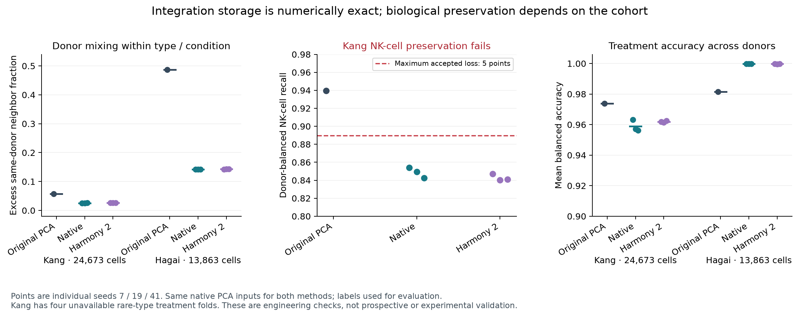

# File-backed donor/batch integration

PCA integration now stores its large latent matrices in bounded file mappings.
All six real-cohort trajectories match the pre-refactor solver bit-for-bit.
Biological preservation is a separate result: the independent Hagai cohort passes
its declared margins, while full Kang fails NK-cell preservation. This does not
qualify general multi-donor integration.



## Use and ownership

```sh
numivivo singlecell-pca-integrate pca --plan integration.json --output integrated
numivivo singlecell-pca-integrate-verify integrated
numivivo singlecell-pca-neighbors integrated --plan neighbors.json --output graph
```

`integration.json`:

```json
{
  "schemaVersion": 1,
  "inputKind": "fitted",
  "integration": {
    "covariate": "donor",
    "clusters": 100,
    "diversity": 2,
    "ridge": 1,
    "temperature": 0.1,
    "maximumIterations": 10,
    "relativeTolerance": 0.01,
    "seed": 7,
    "maximumWork": 1000000000
  }
}
```

`neighbors.json`:

```json
{
  "schemaVersion": 1,
  "inputKind": "integrated",
  "neighbors": {"neighbors": 15, "representation": "integrated"},
  "execution": {"workers": 1},
  "approximation": {"connections": 16, "constructionWidth": 200, "searchWidth": 128, "seed": 7},
  "storage": "binary"
}
```

The file integration plan accepts original fitted or query PCA. Query integration
fits a new transductive correction on those query cells; it is not a frozen
reference correction or unseen-donor transform. An already integrated parent is
rejected. Graph input kind and representation must both explicitly select
`integrated`; omitted representation still selects original PCA for fitted/query
inputs. Exact/HNSW graphs and their clustering/embedding consumers retain that
choice. `batch` is also supported when its metadata are known and eligible.

`VivoSingleCellIntegration` owns one shared numerical solver. Resident analysis
materializes its result; `VivoPCAIntegration` publishes separate matrix files.
`VivoIntegrationMatrix` owns checked row access, private scratch, one shared
64 MiB mapping per matrix, and explicit cleanup. Rows contain little-endian f64
values padded to a power-of-two byte stride, so a row cannot cross a window.
Six matrices hold original scores, normalized initialization, corrected scores,
memberships, assignment distances and final assignment scores. Cell identities,
covariate indices, shuffled permutations and small cluster/batch systems remain
resident. There is no cells-by-genes dense allocation.

Each output retains the original PCA bundle under `input/`, unchanged metadata,
corrected `scores.bin`, `memberships.bin`, `assignment-scores.bin`, the plan,
report and receipt. Final matrices use complete row-major 16-byte records:
UInt32 row, UInt32 column, f64 bits, all little endian. The small report retains
levels, per-cell level indices, assignment centers, every objective/improvement,
stopping reason, ridge residual and storage bounds. Large membership JSON is
not emitted by this path. Scratch files are not restart checkpoints.

Publication uses a private staging directory and a new destination. Verification
reconstructs the parent and correction with the executing binary's identity and
compares every artifact fingerprint. Rehashing modified outputs or a modified
parent does not make them valid. New binaries require fresh PCA inputs.

The admission index remains `N * K * D * (maximumIterations + 10)` with an
unchanged default maximum of 200 million. An explicit maximum up to 100 billion
is now accepted. Axes are at most one million cells, 64 PCs, 100 clusters and
128 covariate levels. These are bounds, not million-cell qualification or a
measured operation count. File-backed random block sweeps above the mapping
window have not received a million-cell throughput measurement. This is CPU
execution; no Metal or same-host scverse performance claim.

## Full-cohort evidence, 2026-09-09

The executable is `875342497c2874036a521310d290bfceadd578b4d88337389ea4e56f21d69b07`.
All 505 recorded production source files match the tested Mac mini checkout.
Swift 6.3.3, macOS 26.6, M4 Pro, 24 GiB; HDF5 2.2.0 library fingerprint and exact
compiler output are retained in `validation/`. Release and scoped builds pass.
There are 86 passing tests in 26 suites, 54 integration CLI checks including
14 expected rejections, and 22 original-PCA graph regression checks including
six expected rejections. Twenty-two full-cohort integration/oracle/replay
commands and six full-Kang downstream commands completed, including one expected
full-Baron rejection. The initial fixture accidentally reused training cell IDs;
its correct query-overlap rejection is retained separately, followed by corrected
fixtures with distinct query IDs. No native failure was replaced by synthetic
biological evidence.

`LegacyIntegrationReference.swift` freezes the numerical body and result shape
from `f129080a6abcd711b109a18c958fa0ef4baa5b61`; the manifest describes import,
owner/result names and the cells/scores argument wrapper. All corrected scores,
memberships and assignment-score FP64 bits, cell axes and diagnostics match for
seeds 7, 19 and 41 on both full cohorts. Independent NumPy dense normal-equation
solves and objective reconstruction additionally pass: maximum coordinate error
is 1.279e-13 for Kang and 8.172e-14 for Hagai. A frozen implementation oracle is
not the same evidence as this independent algebraic reconstruction.

Native single-run lifecycle observations include parent reconstruction and file
serialization. Reference Harmony runs used the laptop, so timings are not paired
CPU/scverse comparisons. The isolated legacy oracle is also a different scope.

| Full cohort | Cells | Integration seconds, three seeds | Peak integration RSS, bytes | Replay seconds |
| --- | ---: | ---: | ---: | ---: |
| Kang | 24,673 | 12.71–13.40 | 265,388,032–266,600,448 | 12.70–13.50 |
| Hagai | 13,863 | 17.33–17.34 | 259,260,416–264,323,072 | 17.23–17.36 |

The independent graph check searches all 24,673 Kang integrated cells against
all cells: mean nonself HNSW recall is 0.99997105, fifth percentile 1.0, and saved
distances equal SciPy distances in this run. The graph is positive, symmetric
and connected. Louvain and 500-epoch UMAP publish and replay successfully;
clustering reports modularity 0.857391 and no disconnected communities. This
establishes downstream wiring and numerical execution, not cell annotation or
biological preservation of the layout.

## Biological acceptance and retained failures

The protocol precedes native/reference outputs. Each method uses the same native
20-PC fit with 2,000 requested variable genes, theta 2, ridge 1, temperature .1,
100 clusters and at most ten iterations. All source cells and genes enter the
fit; feature selection is explicit. Both native and pinned `harmonypy==2.0.0`
use seeds 7/19/41; reference initialization/precision differ. Exact 30-neighbor
mixing is evaluated within source cell-type/condition strata. Classifier scaling
and fitting hold out each donor, but integration sees all unlabeled cells, so
these remain transductive evaluations. Labels never guide the correction fit.

Kang retains all 24,673 cells and 15,706 genes in the pinned public source, eight
paired donors and eight annotated types. The prepared sparse counts and cell/gene
axes are exactly checked against the original source. Hagai retains all 13,863
cells and 22,048 genes from the original author QC cluster0, three paired mouse
individuals and six samples. Its source-supported donor mapping comes from the
prior retained NB SDRF/supplement checks; mouse1/2/3 prefixes identify timecourses,
without claiming a prefix-to-supplement-table-row mapping. Hagai has one retained
author cluster and no mapped per-cell type column (the evaluator retains
`unreported` as the single stratum); it cannot establish diverse-cell-type
preservation.

| Measurement | Kang original | Kang native range | Hagai original | Hagai native range |
| --- | ---: | ---: | ---: | ---: |
| Excess same-donor neighbors | 0.057125 | 0.025546–0.026006 | 0.487372 | 0.142165–0.142569 |
| Mean condition balanced accuracy | 0.973819 | 0.956291–0.963199 | 0.981466 | 0.999771–0.999807 |
| RNA program Spearman | 0.940498 | 0.938309–0.938411 | 0.819807 | 0.814469–0.814767 |
| Within-stratum program Spearman | 0.587057 | 0.587440–0.594484 | 0.483682 | 0.453298–0.454006 |

Declared margins allow at most .02 loss in aggregate type/condition accuracy,
.05 in each type's recall and RNA-program correlation, and require better mixing.
These are fixed engineering margins, not confidence intervals. The RNA programs
are unweighted means of declared log-normalized genes; no missing marker is
dropped. Hagai's within-stratum program correlation decreases by about .03; it
passes the tolerance, not complete preservation. All three Hagai native runs pass
its applicable margins and condition-erasure control.

Kang fails: NK-cell recall drops from 0.939737 to 0.842440–0.854125, exceeding the
.05 limit for every seed. The independent Harmony reference also fails, with
NK recall 0.840253–0.847280. Aggregate type accuracy improves, demonstrating why
that metric alone is insufficient. Rare megakaryocyte recall does not trigger
this failure, but four donor/type treatment folds are unavailable and ten
program-correlation strata lack enough variable observations. Their identities
and counts remain explicit; they are not filled or silently pooled.

The predeclared global condition-centering control also fails its required .10
accuracy loss on Kang: 0.973819 becomes 0.933979. Cell-type centering does expose
type loss. A separately declared supplementary diagnostic removes each
cell-type/condition mean and lowers condition accuracy by 0.628288, detecting
type-specific response erasure. It does not replace the failed original control,
retune native gates or promote Kang integration. These label-informed destructive
controls are never candidate integration methods.

All 8,569 Baron cells are fitted, then donor integration is correctly rejected:
donor and T2D condition form a disconnected design. No nonT2D-only subset is used
to turn that rejection into a success.

The next biological gap is preservation of distinct immune populations under
correction, evaluated with controls sensitive to type-specific responses. Any
method or parameter change needs a new declared development/validation split;
these failed benchmarks must not be reused as an undisclosed tuning target.
Multiple simultaneous covariates, prospective reference correction, independent
rare-state validation and million-cell performance remain open.

Reproduction entry points: `prepare_full_integration.py`,
`run_file_integration.py`, `check_full_integration.py`,
`check_integration_erasure.py`, `run_integrated_graph.py`,
`check_integrated_graph.py`, `check_file_integration.py` and
`plot_integration_preservation.py`. The archive retains full reference/native
coordinates, matrix records, receipts, immutable plans, per-cell neighbors,
folds, controls, timings and source hashes. Large files use deterministic gzip;
real original H5AD files remain externally pinned rather than copied into Git.
