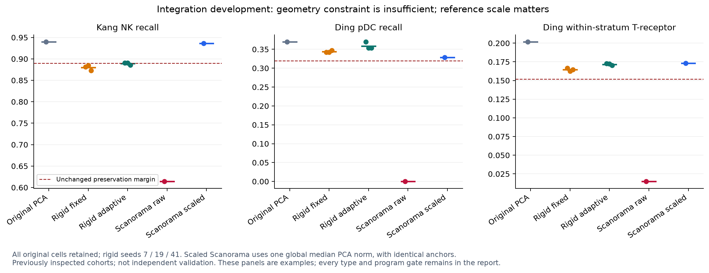

# Integration geometry and reference-scale experiments

A single global PCA scale makes the Scanpy/Scanorama reference pass all measured
preservation gates on Ding and Hagai and all measurable preservation gates on
Kang. Its unscaled run fails these gates. Every matching anchor and the assembly
order are identical between scales: this isolates sensitivity in the Gaussian
correction kernel rather than a change in biological labels or matching.
These are development results on previously inspected cohorts, not new independent
validation or a native NumiVivo implementation. Kang's four missing classifier
strata and Ding's partial source annotations remain unresolved.

An earlier constrained correction experiment is also retained: projecting each
frozen native correction onto one orthogonal transform and translation per batch
preserves within-batch geometry but does not reliably preserve all source types.
All 18 fixed/adaptive candidates and both Scanorama configurations remain recorded.



## Source and evaluation scope

The owner commit is `6f9475a2a2532d6d06daa3e5c0d37b23da755dda`. No native
production source or executable changes in this experiment. Each input is the
exact previously measured native 20-component PCA with unchanged metadata:
Kang 24,673 cells, Hagai 13,863 cells, Ding 44,031 UMI-method cells. All original
rows enter every correction and evaluation. The scripts check the PCA bytes and
literal native covariate assignment before using any evaluation labels.

Kang and Hagai use known donor covariates and donor-held-out classifiers; Ding
uses source Method and experiment-held-out classifiers, with donor identity
unreported. Ding retains only its 29,411 available assigned source labels for
label-based readouts, as documented in [the Ding source report](DING_INTEGRATION.md).
Unknown/unassigned cells remain in correction and full-neighbor program metrics.
Hagai has one source cell type, so no multiclass-type recall claim is made.

All prior engineering margins remain: balanced-accuracy loss at most 0.02,
every-type recall loss at most 0.05, program Spearman loss at most 0.05, and
strictly improved covariate mixing. The fixed exact 30-neighbor and held-out
classifier evaluators are reused. No donor, experiment, rare population, failed
seed, missing fold or program is dropped. Original negative-control results
remain tied to the preceding reports; no new experimental truth is asserted.

## Within-batch geometry constraint

For each native batch/donor level b, center original X and frozen corrected Y,
then solve `min ||X_b Q_b + t_b - Y_b||_F²`, subject to `Q_b.T Q_b = I`.
Translation aligns means; NumPy SVD gives Q. Rotations and reflections are allowed,
with no fitted scale. No label, treatment or program enters this fit. It is the
[orthogonal Procrustes problem](https://docs.scipy.org/doc/scipy/reference/generated/scipy.linalg.orthogonal_procrustes.html)
with explicit centering and translation. The source and target are complete
frozen native coordinates from fixed/adaptive seeds 7, 19 and 41.

The fit checks agreement with SciPy's Procrustes interface, orthogonality,
centered covariance reconstruction, the analytic optimum, and improvement over
translation alone. NumPy and SciPy may share LAPACK; this is not a claim of two
independent numerical backends. The orthogonality norm bounds relative squared
distance error of the algebraic linear map; floating-point transform roundoff
is separate. All transforms, singular values, objectives and projected scores
are retained.

| Cohort | Candidate | Seed | Mixing improved | Every-type recall | Within-stratum programs |
|---|---|---:|---|---|---|
| Kang | fixed | 7 | pass | fail | pass |
| Kang | fixed | 19 | pass | fail | pass |
| Kang | fixed | 41 | pass | fail | pass |
| Kang | adaptive | 7 | pass | pass | pass |
| Kang | adaptive | 19 | pass | pass | pass |
| Kang | adaptive | 41 | pass | fail | pass |
| Hagai | fixed | 7 | pass | not applicable | pass |
| Hagai | fixed | 19 | pass | not applicable | pass |
| Hagai | fixed | 41 | pass | not applicable | pass |
| Hagai | adaptive | 7 | pass | not applicable | pass |
| Hagai | adaptive | 19 | pass | not applicable | pass |
| Hagai | adaptive | 41 | pass | not applicable | pass |
| Ding | fixed | 7 | pass | fail | pass |
| Ding | fixed | 19 | pass | fail | pass |
| Ding | fixed | 41 | pass | fail | pass |
| Ding | adaptive | 7 | pass | fail | pass |
| Ding | adaptive | 19 | pass | fail | pass |
| Ding | adaptive | 41 | pass | fail | pass |

All constrained runs pass their overall accuracy and global-program margins.
All Ding constrained runs restore the within-stratum T-receptor gate and pDC
recall margin, but fail cytotoxic T-cell recall. Fixed Ding runs additionally
fail CD14+ monocyte recall. Only Kang adaptive seeds 7 and 19 pass every-type
recall; the third adaptive seed and all fixed seeds still fail NK recall.
Hagai passes applicable gates throughout. Geometry preservation alone therefore
cannot justify promoting this constrained candidate as general integration.

## Scanpy/Scanorama reference and scale audit

The independent reference uses the public `scanpy.external.pp.scanorama_integrate`
wrapper and [Scanorama 1.7.4](https://github.com/brianhie/scanorama). It operates on
the same native PCA in `obsm`, with a zero-column sparse AnnData X to avoid
copying count matrices. Literal batch levels are sorted, original row order is
preserved within each level, and output rows are restored explicitly. No source
labels enter matching or correction. The reference is a PCA adapter comparison;
it is not Scanorama's separate raw-count preprocessing and 100-component default
pipeline, nor a general ranking of the package.

Scientific parameters stay at k=20, sigma=15 and alpha=0.1. We select exact
matching (`approx=False`) and reduce the correction memory batch to 256. Exact
matching in this package uses Manhattan distances on row-normalized coordinates;
assembly uses an RBF kernel with gamma `0.5 * sigma` on the supplied coordinates.
The same anchors are passed through the public wrapper and retained for inspection.
The exact path has no approximate-neighbor random seed; one deterministic run per
configuration is replayed, rather than presented as three independent samples.

The initial supplied coordinates retain native PCA amplitudes. After those runs
failed preservation, a separately declared sensitivity audit divides every row
and coordinate by the single scalar `median_i ||x_i||₂`, then rescales output.
This choice uses no labels or target metrics, but was made after observing failure;
it is explicitly retrospective development. There is no grid search, per-cell
normalization, batch-specific scale or altered acceptance margin.

The positive uniform scale leaves baseline geometry unchanged: all global and
stratified neighbor indices match exactly on every cohort, and every baseline
metric differs by at most 1e-12. Anchor pairs and assembly order also match exactly
between raw and scaled runs. The changed correction reflects kernel width in PCA
units. This is why a fixed numerical sigma cannot be compared without recording
the coordinate scale.

| Cohort | Global scale | Original mixing excess | Scaled mixing excess | Original type accuracy | Scaled type accuracy | Scaled measured preservation |
|---|---:|---:|---:|---:|---:|---|
| Kang | 8.965491 | 0.057125 | 0.034965 | 0.910778 | 0.907235 | pass; 4 missing classifier strata |
| Hagai | 10.246000 | 0.487372 | 0.281448 | not applicable | not applicable | pass; applicable gates |
| Ding | 7.222172 | 0.704231 | 0.436751 | 0.660902 | 0.654672 | pass; partial source labels |

Scaled Kang NK recall is 0.936217 (original 0.939737); all source types stay within
the 0.05 margin. Scaled Ding pDC recall is 0.328914 (original 0.369736) and
cytotoxic T-cell recall is 0.630250 (original 0.673474), both within the unchanged
margin. Ding within-stratum T-receptor correlation is 0.173048 (original 0.201722).
Hagai within-stratum program correlation is 0.482328 (original 0.483682).
The relatively small headroom for some Ding types remains relevant; these are
single deterministic development results, not confidence intervals or prospective
predictions. The original native ridge failures remain unchanged.

Raw Scanorama fails all preservation categories on Kang and Ding; Hagai fails
its within-stratum program gate. These results are retained beside the scaled
runs. Matching source-type agreement is diagnostic only: 96.43% of Kang anchor
pairs and 67.52% of the source-assigned Ding pairs share a source type. The latter
uses only available labels. Agreement was measured after correction and is not
an anchor filter or new inferred annotation. Passing summary gates does not make
every anchor correct.

## Reproducibility and next native boundary

The public Scanpy results are replayed through direct assembly of the pinned
Scanorama library, recomputing all anchors and the assembly order. Every output
coordinate and source-row mapping must agree exactly. This verifies the adapter
and deterministic replay using the same library, not an independent native port.
Source-distribution hash, package versions, imported source-file hashes, input
identities, protocols, logs, neighbors, classifiers, anchors and all results are
retained in the [evidence manifest](evidence/2026-09-10-integration-alternatives/manifest.json).
The [archive check](evidence/2026-09-10-integration-alternatives/archive-checks.json)
verifies both compressed and raw bytes. Original inputs and the isolated Python
dependency directory remain external; no new native executable is claimed.

The viable successor to implement natively is scale-aware mutual-neighbor
alignment with explicit matching and kernel evidence. It needs a distinct method
contract: counts/PCA and identity snapshots stay unchanged; anchors, assembly
order, global scale and correction diagnostics replace ridge-specific witnesses.
Do not fabricate ridge memberships or treat Python output as native execution.
Retain the current ridge default until the native method has independent numerical
reconstruction, replay, downstream graph checks and these full-cohort gates.
Native equivalence and independent unseen-study validation are still open.

The five scripts in this change compile and are scoped benchmark tools:
`evaluate_rigid_integration.py`, `evaluate_scanorama_integration.py`,
`check_integration_scale_baseline.py`, `verify_scanorama_integration.py`, and
`plot_integration_alternatives.py`. They use the existing evaluators without
relaxing their numerical margins or dropping source coverage limits.

```sh
# Work in Tools/Omics/Reduction; PROTOCOL files come from the evidence archive.
python evaluate_rigid_integration.py --cohort COHORT --native NATIVE \
  --inputs INPUTS --protocol RIGID_PROTOCOL --out NEW_RIGID
python check_integration_scale_baseline.py --cohort COHORT \
  --inputs INPUTS --out NEW_BASELINE_CHECK
python evaluate_scanorama_integration.py --cohort COHORT --native NATIVE \
  --inputs INPUTS --protocol RAW_PROTOCOL --scale raw --out NEW_RAW
python evaluate_scanorama_integration.py --cohort COHORT --native NATIVE \
  --inputs INPUTS --protocol SCALE_PROTOCOL --scale median-norm --out NEW_SCALED
python verify_scanorama_integration.py --root NEW_RAW --inputs INPUTS \
  --out NEW_RAW/replay-checks.json
python verify_scanorama_integration.py --root NEW_SCALED --inputs INPUTS \
  --out NEW_SCALED/replay-checks.json
python archive_adaptive_integration.py --verify \
  --out evidence/2026-09-10-integration-alternatives
```

Use the recorded NumPy/SciPy/Scanpy environment with one BLAS/OpenMP thread and the
isolated pinned Scanorama dependencies on PYTHONPATH. Ding exact-distance
readouts use four workers. Python references ran locally; no new Mac mini native
build or test result is claimed, and there is no cross-host speed comparison.
